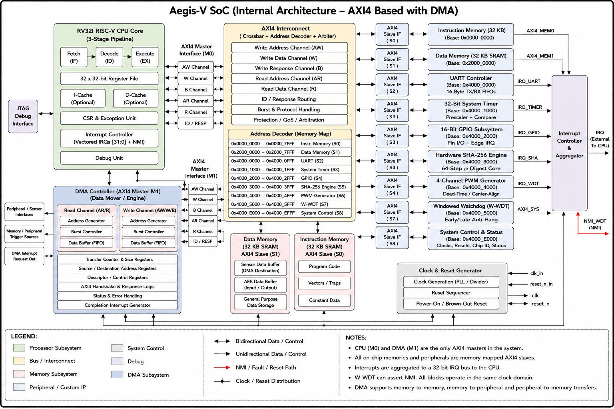

# Aegis‑V SoC


**Aegis‑V — Compact, secure RISC‑V edge-node SoC with hardware SHA‑256, high‑precision PWM, and windowed watchdog**

RISC‑V based secure edge-control System-on-Chip (RV32I, Verilog)

## Project
**Aegis-V** — Design and Verification of a RISC-V Secure Edge Node SoC with Hardware SHA-256 Engine, High-Precision PWM, and Windowed Watchdog

## Author
- Name: Vivek Chakali  
- Roll Number: 1602-23-735-127

## Highlights
- RV32I 3‑stage CPU (AXI4 master)
- 2 AXI4 masters (CPU, DMA) and 9 memory‑mapped slaves
- Hardware SHA‑256 accelerator
- 16‑bit GPIO, 4‑ch PWM, UART, 32‑bit system timer
- Windowed watchdog, vectored IRQs, NMI/fault handling
- RTL: Verilog — Simulation: Synopsys VCS — Debug: Verdi

## Architecture (short)
- AXI4 interconnect: 2 masters × 9 slaves (IMEM, DMEM, UART, Timer, GPIO, SHA‑256, PWM, W‑WDT, SYSCTRL)
- DMA: autonomous AXI4 master for burst transfers
- Safety: watchdog + NMI + fault classification and response

## Block Diagram
<p align="center"></p>

## Memory Map (summary)
- 0x0000_0000 – 0x0000_7FFF : Instruction Memory (32 KB)
- 0x2000_0000 – 0x2000_7FFF : Data Memory (32 KB)
- 0x4000_0000 – 0x4000_EFFF : Peripherals (UART, Timer, GPIO, SHA‑256, PWM, W‑WDT, SYSCTRL)

## Quick start (simulate)
cd into project run directory and build with VCS:
```bash
cd run
vcs -full64 -debug_access+all -f run.f -top tb_axi_interconnect_wrap_2x9 -o sim.out
./sim.out
```
